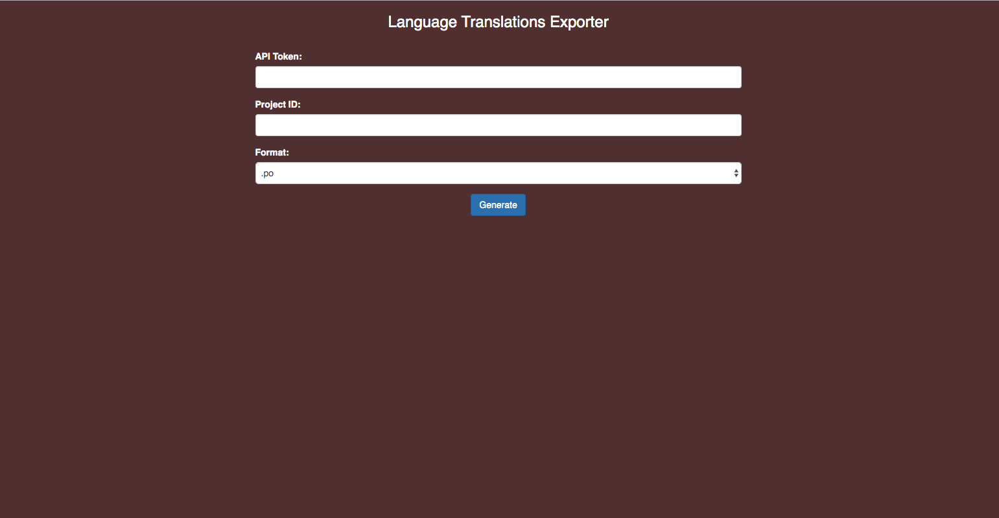

# poeditor-api-languages-exporter
A simple PHP Script to automatically export languages in a specific project on https://poeditor.com/

## Requirements

* API Token
* Project ID

You can find your account `API Token` and `Project ID` in the `Account Settings` located in the `Api Access` tab

